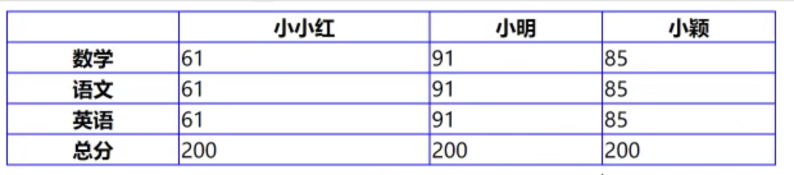
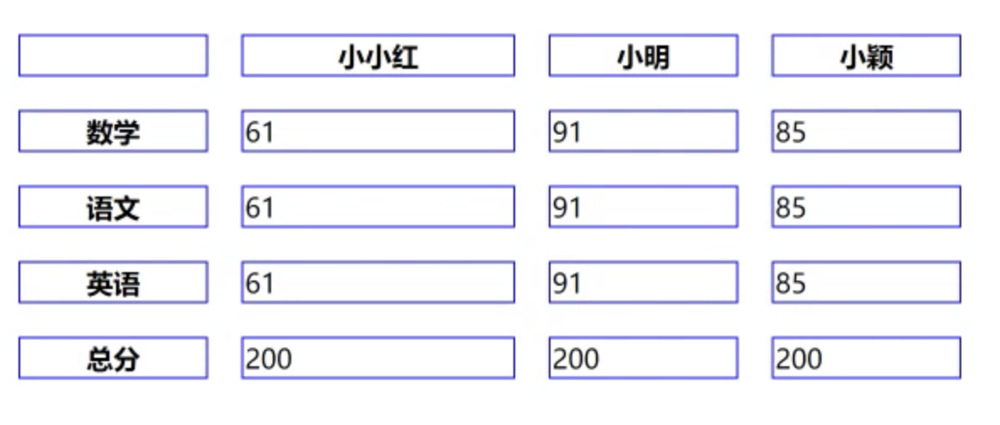

# HTML常用标签

# a 标签的用法

## 属性

href：作用就是写一个网址

target：指定在哪个窗口打开链接, targer="_blank"

download：很多浏览器不支持这个属性

rel=noopener：这个用来防止某个bug，学js的时候会再提到

## a的href的取值

### 网址

https://google.com

http://google.com

以上两种如果网址写错就会有bug，但是如果写成下面这样

//google.com

会自动选择使用http还是https

### 路径

/a/b/c以及a/b/c:

index.html以及./index.html:在当前目录找index.html，两种写法都一样

### 伪协议

#### Javascript:代码

```html
<a href="javascript:alert(1)">javascript伪协议</a>
<a href="javascript:;">javascript空协议</a>//创建一个什么都不做的a标签
```

其他的a标签，比如href什么都不加，点击“空标签”会自动刷新页面

```
<input type="text">
<a href="">空标签</a>
```

又比如，点击#标签，页面会自动跳到最上面一行.

#### id:href=#xxx

跳到指定位置

mailto:发邮件

Tel：打电话

## a的target

_black 空白页面打开

_top:需要用到iframe，在当前页面的最顶层打开

_parent：在当前页面的iframe的上一层打开

_self：在自己的页面打开

**google**不允许任何iframe指向它

# img 标签的用法

```html

```

## 作用

发出get请求，展示一张图片

## 属性

`alt`/`height`/`width`/`src`

alt：替代图片的文字

永远不要让图片变形，只写height/width，会自适应任一个

src：图片的地址

## 事件

`Unload` / `onerror`

```
<body>
    

<script>
xxx.onload = function(){
    console.log("图片加载成功")
}

xxx.onerror = function(){
    console.log("图片加载失败")
}
</script>
</body>
```

## 响应式

`max-width:100%`

加了这个在css中，图片在任何设备中都是响应式的。

## 可替换元素

考试可能会问，被问概率30%

# table 标签的用法

### 相关的标签

`table` `thead` `tbody` `tfoot`

```
   //正确写法
   <table>
        <thead>
        </thead>
        <tbody>
        </tbody>
        <tfoot>
        </tfoot>
    </table>
```

**HTML有超强的纠错能力，如果只写td或者th，浏览器会自动加上tbody，th**

### 相关的样式

#### table-layout

auto:自动 根据内容调整宽度，内容长的更宽

fixed:根据表格的宽度，会等宽

#### border-collapse

border-collapse:collapse表格边框合并



#### border-spacing

Border-spacing: 20px 表格边框间距



# 其他感想


